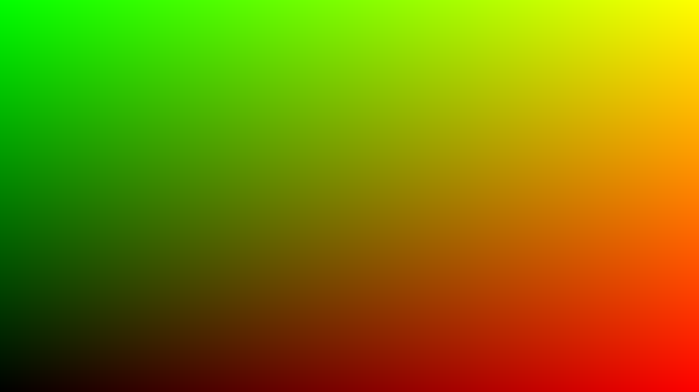
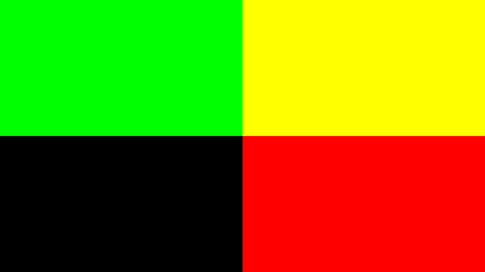
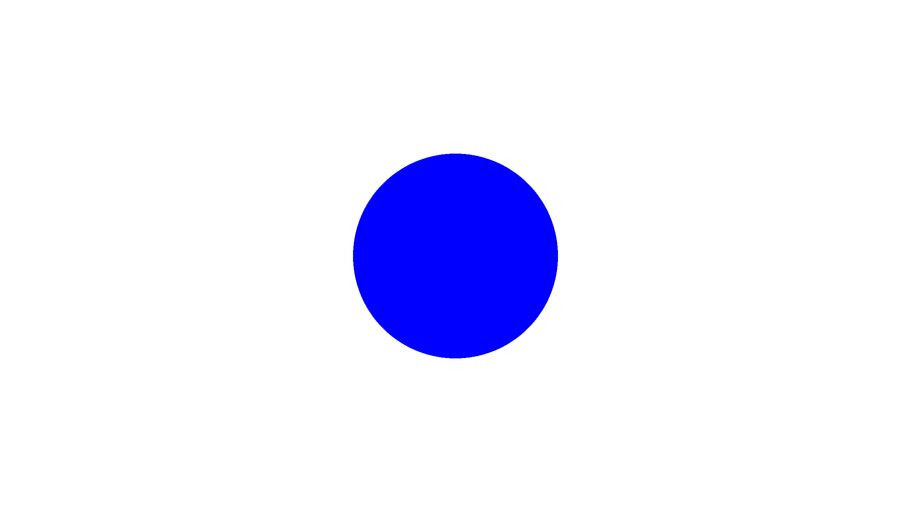
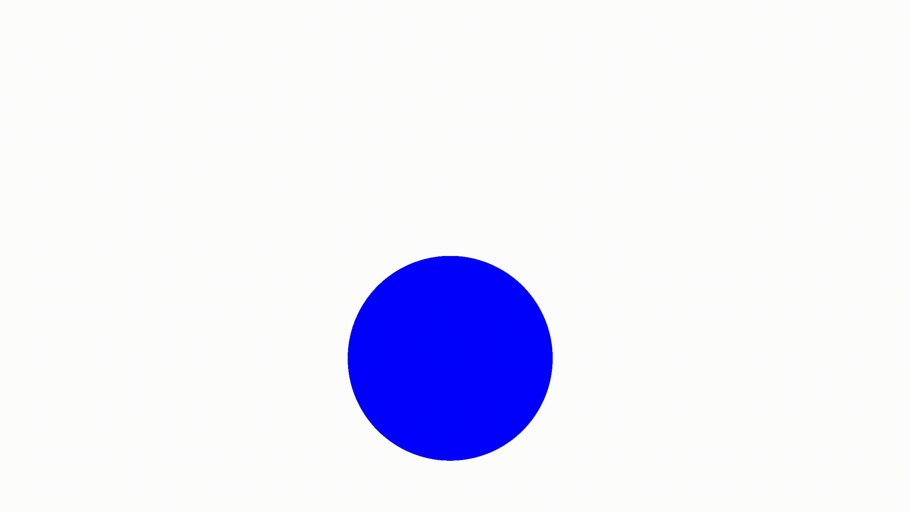
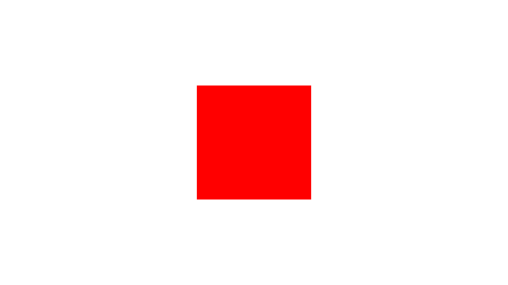
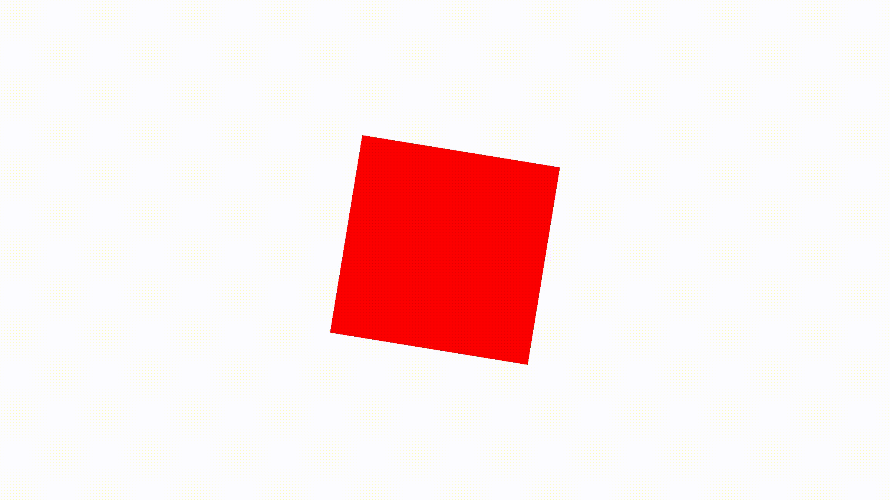
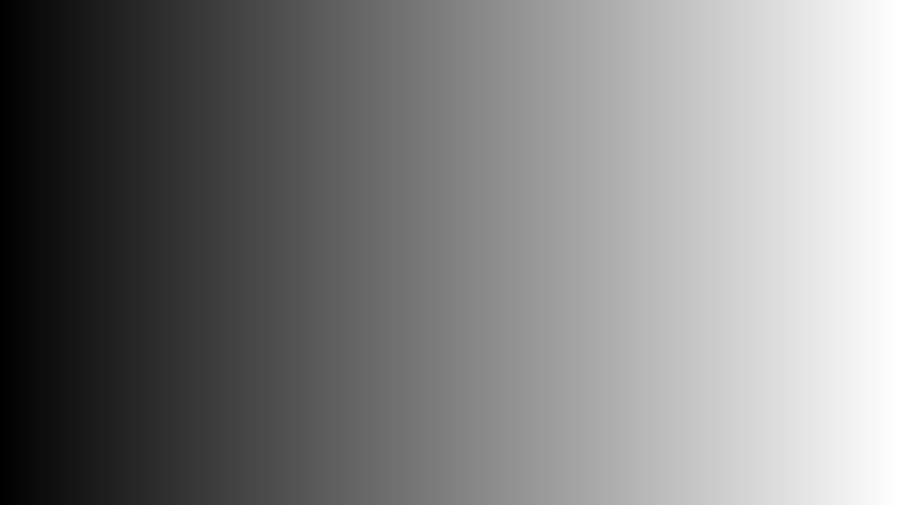
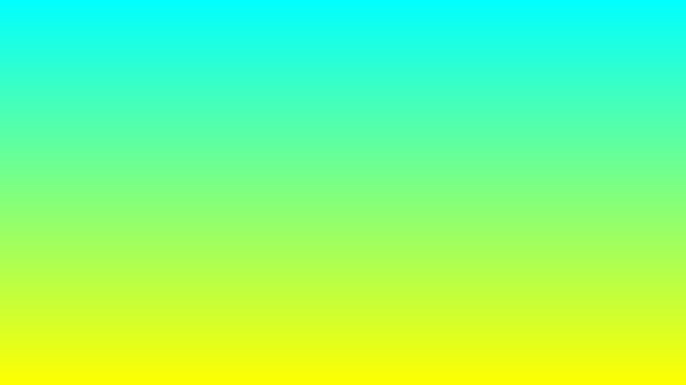
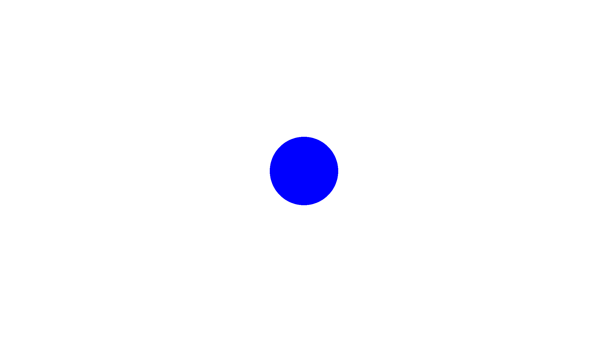
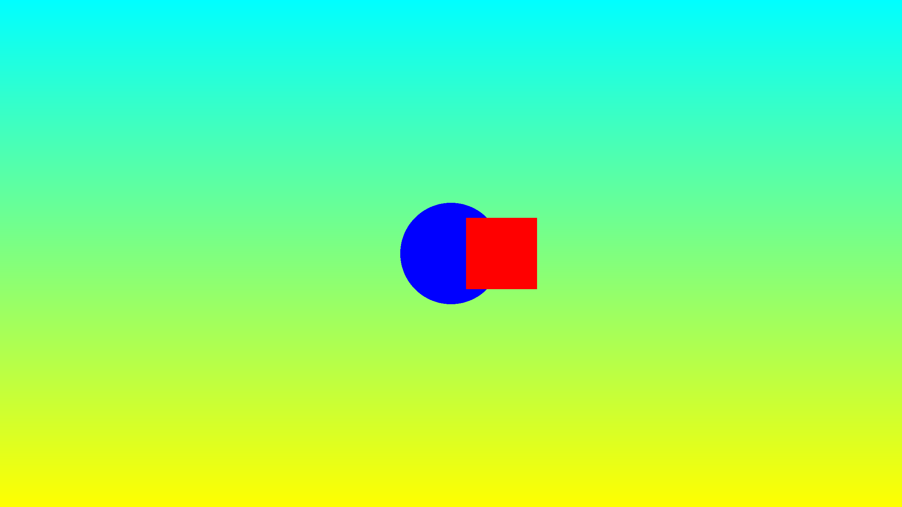

# ShaderToy-Tutorial 🖼️
Tutorial codes from [Shadertoy series](https://inspirnathan.com/posts/47-shadertoy-tutorial-part-1/) by [Nathan Vaughn](https://twitter.com/inspirnathan).

## 01 Intro
 The `uv` variable represents the normalized canvas coordinates between zero and one on both the x-axis and the y-axis. The bottom-left corner of the canvas has the coordinate (0, 0). The top-right corner of the canvas has the coordinate (1, 1).
 ```glsl
   vec2 uv = fragCoord/iResolution.xy; // <0,1>
 ```
[](01/uv.glsl)

## 02 Circles and Animation
The `step` function accepts two inputs: the edge of the step function, and a value used to generate the step function. If the second parameter in the function argument is greater than the first, then return a value of one. Otherwise, return a value of zero.
```glsl
  col = vec3(step(0.5, uv), 0); // perform step function across the x-component and y-component of uv
```
[](02/step.glsl)

A function called `sdfCircle` that returns the color, white, for each pixel at an XY-coordinate such that the equation is greater than zero and the color, blue, otherwise.
```glsl
vec3 sdfCircle(vec2 uv, float r) {
    float x = uv.x;
    float y = uv.y;
    
    float d = length(vec2(x, y)) - r;
    
    return d > 0. ? vec3(1.) : vec3(0., 0., 1.);
}
```
[](02/circle.glsl)

Use the global `iTime` variable to change colors over time.
```glsl
  return d > 0. ? vec3(0.) : 0.5 + 0.5 * cos(iTime + uv.xyx + vec3(0,2,4));
```
[](02/colorful.glsl)

Adjust the `sdfCircle` function to allow `offsets` and then move the center of the circle using `iTime`.
```glsl
vec3 sdfCircle(vec2 uv, float r, vec2 offset) {
  float x = uv.x - offset.x;
  float y = uv.y - offset.y;
  // ...
}

void mainImage( out vec4 fragColor, in vec2 fragCoord )
{
  // ...
  
  vec2 offset = vec2(sin(iTime*2.)*0.2, cos(iTime*2.)*0.2); // move the circle clockwise
  
  vec3 col = sdfCircle(uv, .2, offset);

  //...
}
```
[](02/rotate.glsl)

## 03 Squares and Rotation
Drawing a square is very similar to drawing a circle except we will use the following equation: 
```glsl
vec3 sdfSquare(vec2 uv, float size, vec2 offset) {
  float x = uv.x - offset.x;
  float y = uv.y - offset.y;
  float d = max(abs(x), abs(y)) - size;
  
  return d > 0. ? vec3(1.) : vec3(1., 0., 0.);
}
```
[](03/square.glsl)

A `rotate` function that accepts UV coordinates and an angle by which to rotate the square.
```glsl
vec2 rotate(vec2 uv, float th) {
  return mat2(cos(th), sin(th), -sin(th), cos(th)) * uv;
}
```
[](3/rotate.glsl)

## 04 Mutiple 2D Shapes and Mixing
The `mix` function linearly interpolates between two values. Same as `lerp` in HLSL.
```glsl
  float interpolatedValue = mix(0., 1., uv.x);
```
[](04/mix.glsl)
When using the `mix` function on vectors, it will use the third parameter to interpolate each vector on a component basis.
```glsl
    return mix(gradientStartColor, gradientEndColor,
             uv.y); // gradient goes from bottom to top
```
[](04/gradient.glsl)
we are now abstracting out a few things. We have a `drawScene` function that will be responsible for rendering the scene, and the `sdfCircle` now returns a float that represents the "signed distance" between a pixel on the screen and a point on the circle.
```glsl
float sdfCircle(vec2 uv, float r, vec2 offset) {
  float x = uv.x - offset.x;
  float y = uv.y - offset.y;

  return length(vec2(x, y)) - r;
}

vec3 drawScene(vec2 uv) {
  vec3 col = vec3(1);
  float circle = sdfCircle(uv, 0.1, vec2(0, 0));

  col = mix(vec3(0, 0, 1), col, step(0., circle));

  return col;
}
```
[](04/circle.glsl)
Using the `mix` function with this approach lets us easily render multiple 2D shapes to the scene!
```glsl
float sdfSquare(vec2 uv, float size, vec2 offset) {
  float x = uv.x - offset.x;
  float y = uv.y - offset.y;

  return max(abs(x), abs(y)) - size;
}

vec3 drawScene(vec2 uv) {
  vec3 col = vec3(1);
  float circle = sdfCircle(uv, 0.1, vec2(0, 0));
  float square = sdfSquare(uv, 0.07, vec2(0.1, 0));
  
  col = mix(vec3(0, 0, 1), col, step(0., circle));
  col = mix(vec3(1, 0, 0), col, step(0., square));
  
  return col;
}
```
[](04/circle_plus_square.glsl)