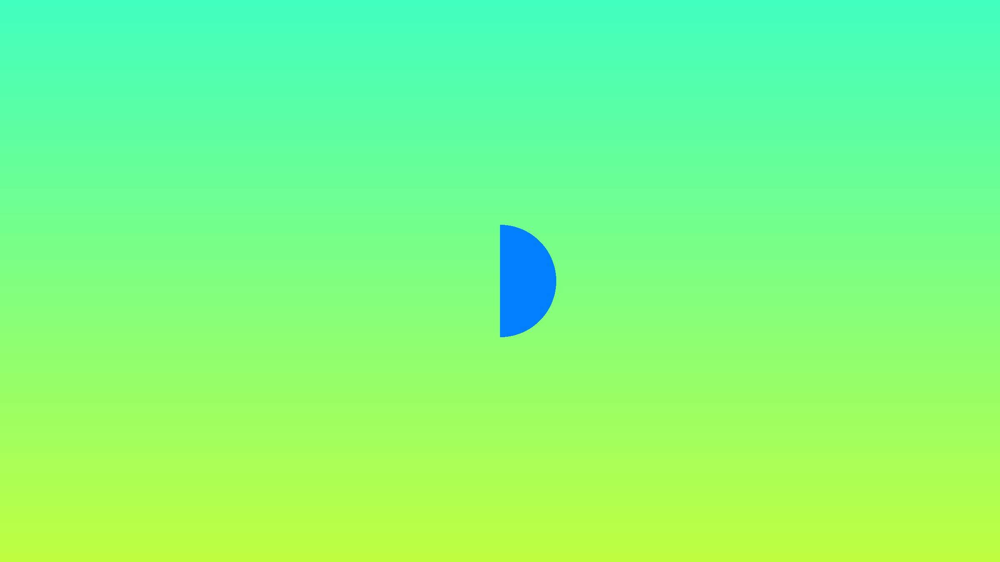
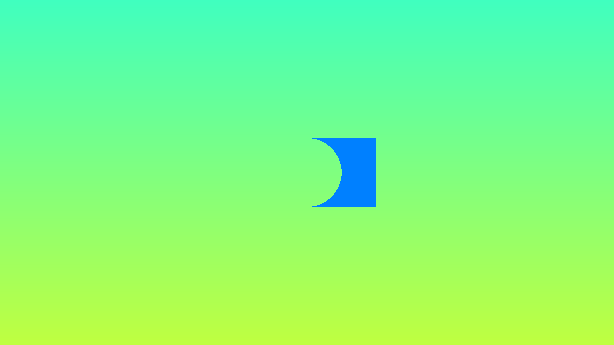
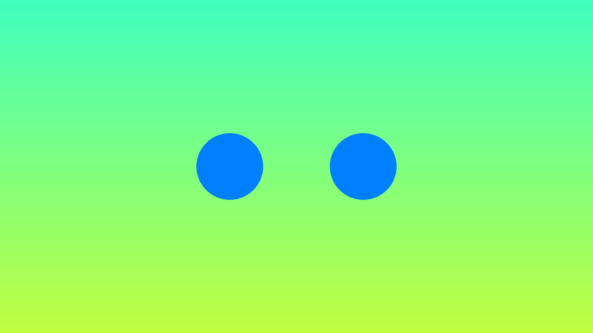
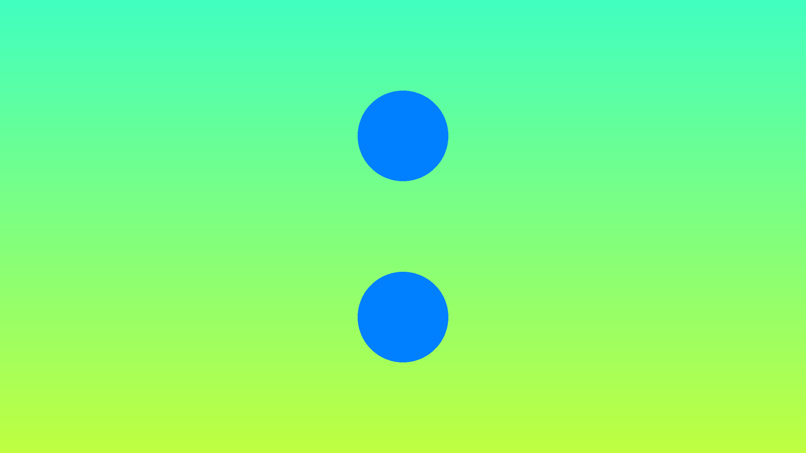
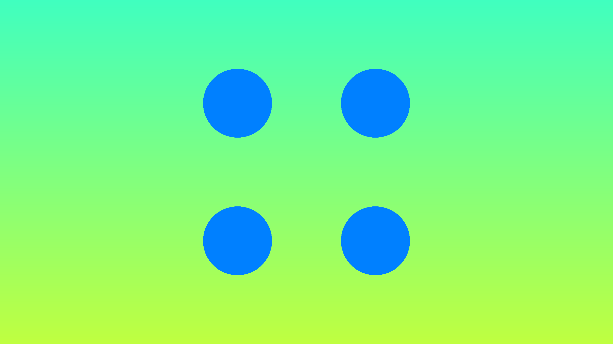
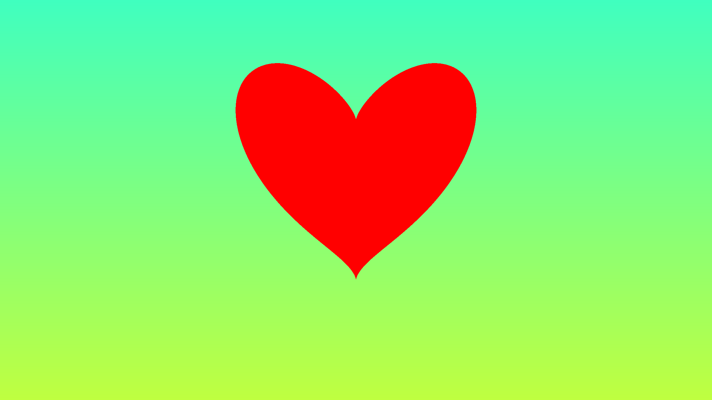
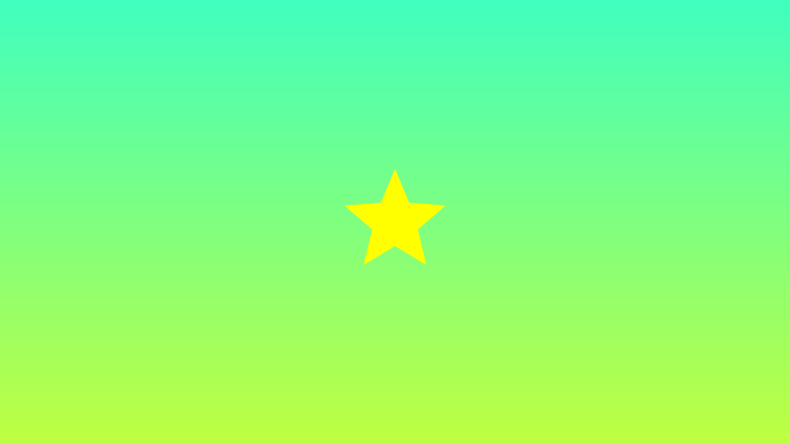
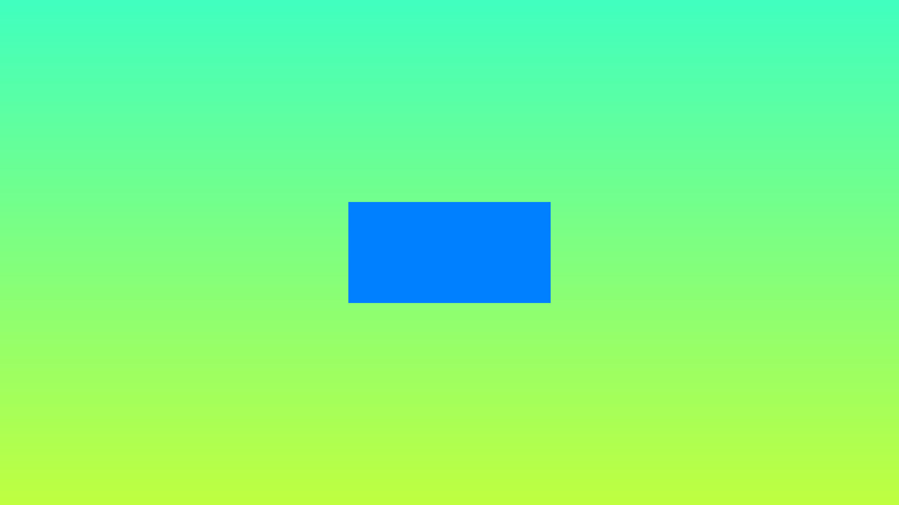
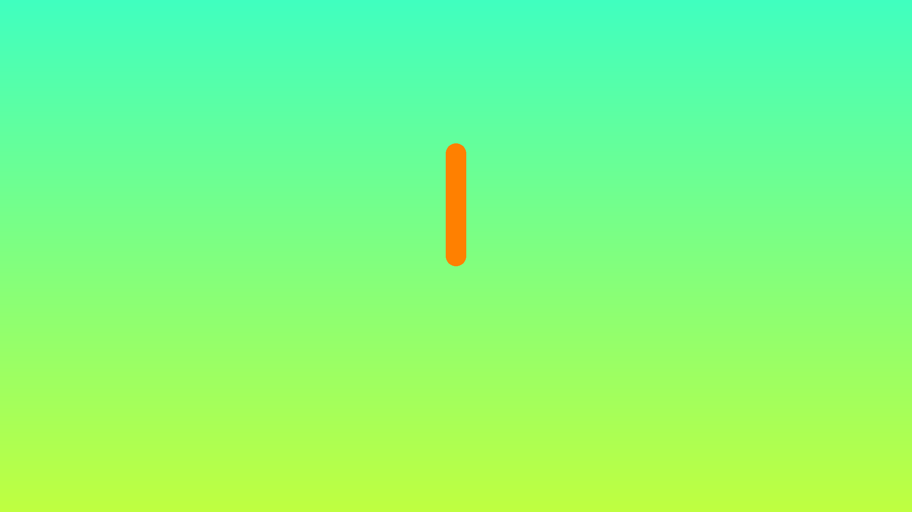
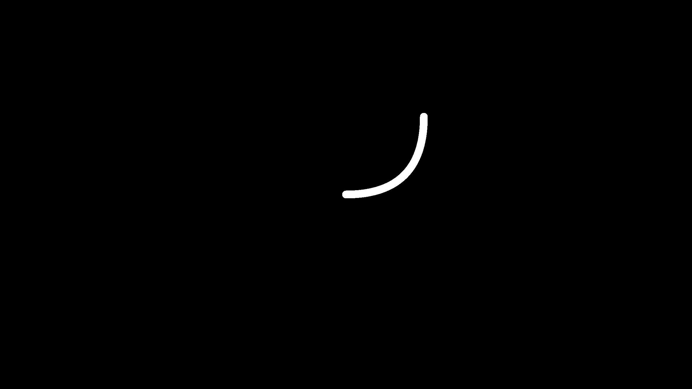

# ShaderToy-Tutorial 🖼️
Tutorial codes from [Shadertoy series](https://inspirnathan.com/posts/47-shadertoy-tutorial-part-1/) by [Nathan Vaughn](https://twitter.com/inspirnathan).

## 01 Intro
 The `uv` variable represents the normalized canvas coordinates between zero and one on both the x-axis and the y-axis. The bottom-left corner of the canvas has the coordinate (0, 0). The top-right corner of the canvas has the coordinate (1, 1).
 ```glsl
   vec2 uv = fragCoord/iResolution.xy; // <0,1>
 ```
[](01/uv.glsl)

## 02 Circles and Animation
The `step` function accepts two inputs: the edge of the step function, and a value used to generate the step function. If the second parameter in the function argument is greater than the first, then return a value of one. Otherwise, return a value of zero.
```glsl
  col = vec3(step(0.5, uv), 0); // perform step function across the x-component and y-component of uv
```
[](02/step.glsl)

A function called `sdfCircle` that returns the color, white, for each pixel at an XY-coordinate such that the equation is greater than zero and the color, blue, otherwise.
```glsl
vec3 sdfCircle(vec2 uv, float r) {
    float x = uv.x;
    float y = uv.y;
    
    float d = length(vec2(x, y)) - r;
    
    return d > 0. ? vec3(1.) : vec3(0., 0., 1.);
}
```
[](02/circle.glsl)

Use the global `iTime` variable to change colors over time.
```glsl
  return d > 0. ? vec3(0.) : 0.5 + 0.5 * cos(iTime + uv.xyx + vec3(0,2,4));
```
[](02/colorful.glsl)

Adjust the `sdfCircle` function to allow `offsets` and then move the center of the circle using `iTime`.
```glsl
vec3 sdfCircle(vec2 uv, float r, vec2 offset) {
  float x = uv.x - offset.x;
  float y = uv.y - offset.y;
  // ...
}

void mainImage( out vec4 fragColor, in vec2 fragCoord )
{
  // ...
  
  vec2 offset = vec2(sin(iTime*2.)*0.2, cos(iTime*2.)*0.2); // move the circle clockwise
  
  vec3 col = sdfCircle(uv, .2, offset);

  //...
}
```
[](02/rotate.glsl)

## 03 Squares and Rotation
Drawing a square is very similar to drawing a circle except we will use the following equation: 
```glsl
vec3 sdfSquare(vec2 uv, float size, vec2 offset) {
  float x = uv.x - offset.x;
  float y = uv.y - offset.y;
  float d = max(abs(x), abs(y)) - size;
  
  return d > 0. ? vec3(1.) : vec3(1., 0., 0.);
}
```
[](03/square.glsl)

A `rotate` function that accepts UV coordinates and an angle by which to rotate the square.
```glsl
vec2 rotate(vec2 uv, float th) {
  return mat2(cos(th), sin(th), -sin(th), cos(th)) * uv;
}
```
[](3/rotate.glsl)

## 04 Mutiple 2D Shapes and Mixing
The `mix` function linearly interpolates between two values. Same as `lerp` in HLSL.
```glsl
  float interpolatedValue = mix(0., 1., uv.x);
```
[](04/mix.glsl)
When using the `mix` function on vectors, it will use the third parameter to interpolate each vector on a component basis.
```glsl
    return mix(gradientStartColor, gradientEndColor,
             uv.y); // gradient goes from bottom to top
```
[](04/gradient.glsl)
we are now abstracting out a few things. We have a `drawScene` function that will be responsible for rendering the scene, and the `sdfCircle` now returns a float that represents the "signed distance" between a pixel on the screen and a point on the circle.
```glsl
float sdfCircle(vec2 uv, float r, vec2 offset) {
  float x = uv.x - offset.x;
  float y = uv.y - offset.y;

  return length(vec2(x, y)) - r;
}

vec3 drawScene(vec2 uv) {
  vec3 col = vec3(1);
  float circle = sdfCircle(uv, 0.1, vec2(0, 0));

  col = mix(vec3(0, 0, 1), col, step(0., circle));

  return col;
}
```
[](04/circle.glsl)
Using the `mix` function with this approach lets us easily render multiple 2D shapes to the scene!
```glsl
float sdfSquare(vec2 uv, float size, vec2 offset) {
  float x = uv.x - offset.x;
  float y = uv.y - offset.y;

  return max(abs(x), abs(y)) - size;
}

vec3 drawScene(vec2 uv) {
  vec3 col = vec3(1);
  float circle = sdfCircle(uv, 0.1, vec2(0, 0));
  float square = sdfSquare(uv, 0.07, vec2(0.1, 0));
  
  col = mix(vec3(0, 0, 1), col, step(0., circle));
  col = mix(vec3(1, 0, 0), col, step(0., square));
  
  return col;
}
```
[](04/circle_plus_square.glsl)

## 05 2D SDF Operations and More 2D Shapes

### Combination 2D SDF Operations
| Union | Intersection | Subtraction | XOR |
| :---: | :---: | :---: | :---: |
| combine two shapes together. | take only the part where the two shapes intersect. | subtract d1 from d2. | take the parts of the two shapes that do not intersect with each other |
| `  res = min(d1, d2);` | `res = max(d1, d2);` | `res = max(-d1, d2);` | `res = max(min(d1, d2), -max(d1, d2));` |
| [](05/union.glsl) |[](05/intersection.glsl) | [](05/subtraction.glsl)| [](05/xor.glsl) |

### Positional 2D SDF Operations
| Symetric along X axis | Symetric along Y axis | Symetric along X and Y axis | 
| :---: | :---: | :---: |
| [](05/symetry.glsl) | [](05/symetry.glsl) |[](05/symetry.glsl)|

### More 2D Shapes
| Heart | Star | Box | Segment | 
| :---: | :---: | :---: | :---: |
|[](05/heart.glsl) | [](05/star.glsl) | [](05/box.glsl) | [](05/segment.glsl) |
```glsl
float sdHeart(vec2 uv, float size, vec2 offset) {
  float x = uv.x - offset.x;
  float y = uv.y - offset.y;
  float group = dot(x, x) + dot(y, y) - size;
  float d = group * dot(group, group) - dot(x, x) * dot(y, y) * y;

  return d;
}

float sdStar5(in vec2 p, in float r, in float rf, vec2 offset) {
  p -= offset; // This will subtract offset.x from p.x and subtract offset.y
               // from p.y
  const vec2 k1 = vec2(0.809016994375, -0.587785252292);
  const vec2 k2 = vec2(-k1.x, k1.y);
  p.x = abs(p.x);
  p -= 2.0 * max(dot(k1, p), 0.0) * k1;
  p -= 2.0 * max(dot(k2, p), 0.0) * k2;
  p.x = abs(p.x);
  p.y -= r;
  vec2 ba = rf * vec2(-k1.y, k1.x) - vec2(0, 1);
  float h = clamp(dot(p, ba) / dot(ba, ba), 0.0, r);
  return length(p - ba * h) * sign(p.y * ba.x - p.x * ba.y);
}

float sdBox(in vec2 p, in vec2 b, vec2 offset) {
  p -= offset;
  vec2 d = abs(p) - b;
  return length(max(d, 0.0)) + min(max(d.x, d.y), 0.0);
}

float sdSegment(in vec2 p, in vec2 a, in vec2 b) {
  vec2 pa = p - a, ba = b - a;
  float h = clamp(dot(pa, ba) / dot(ba, ba), 0.0, 1.0);
  return length(pa - ba * h);
}
```

Quadratic Bézier curves accept three control points. In 2D, each control point will be a vec2 value with an x-component and y-component.
```glsl
float dot2(in vec2 v) { return dot(v, v); }

float sdBezier(in vec2 pos, in vec2 A, in vec2 B, in vec2 C) {
  vec2 a = B - A;
  vec2 b = A - 2.0 * B + C;
  vec2 c = a * 2.0;
  vec2 d = A - pos;
  float kk = 1.0 / dot(b, b);
  float kx = kk * dot(a, b);
  float ky = kk * (2.0 * dot(a, a) + dot(d, b)) / 3.0;
  float kz = kk * dot(d, a);
  float res = 0.0;
  float p = ky - kx * kx;
  float p3 = p * p * p;
  float q = kx * (2.0 * kx * kx - 3.0 * ky) + kz;
  float h = q * q + 4.0 * p3;
  if (h >= 0.0) {
    h = sqrt(h);
    vec2 x = (vec2(h, -h) - q) / 2.0;
    vec2 uv = sign(x) * pow(abs(x), vec2(1.0 / 3.0));
    float t = clamp(uv.x + uv.y - kx, 0.0, 1.0);
    res = dot2(d + (c + b * t) * t);
  } else {
    float z = sqrt(-p);
    float v = acos(q / (p * z * 2.0)) / 3.0;
    float m = cos(v);
    float n = sin(v) * 1.732050808;
    vec3 t = clamp(vec3(m + m, -n - m, n - m) * z - kx, 0.0, 1.0);
    res = min(dot2(d + (c + b * t.x) * t.x), dot2(d + (c + b * t.y) * t.y));
    // the third root cannot be the closest
    // res = min(res,dot2(d+(c+b*t.z)*t.z));
  }
  return sqrt(res);
}
```
[](05/bezier_curve.glsl)

Many more shapes can be found in Inigo Quilez's [website](https://www.iquilezles.org/www/articles/distfunctions2d/distfunctions2d.htm).

### Conclusion
We can use 2D operations together with Bézier curves to create interesting effects. We can subtract two Bézier curves from a circle to get some kind of tennis ball 🎾.
[](05/tennis_ball.glsl)